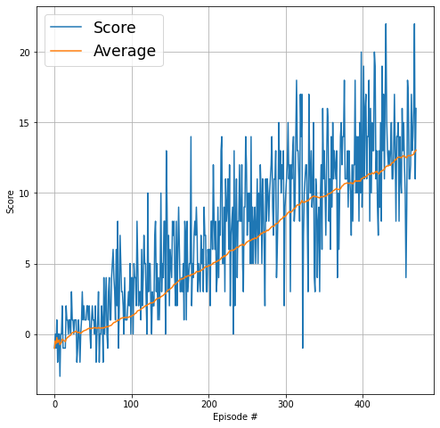

# Report
This document contains my report for the Udacity `Navigation` project. It includes the project goal, environment, learning algorithm, results and ideas for future work

## The Goal

The aim of this project is to train an agent to navigate (and collect bananas!) in a large, square world.
The task is episodic, and in order to solve the environment, your agent must get an average score of +13 over 100 consecutive episodes.


## The Environment

A reward of +1 is provided for collecting a yellow banana, and a reward of -1 is provided for collecting a blue banana. Thus, the goal of your agent is to collect as many yellow bananas as possible while avoiding blue bananas.
The state space has 37 dimensions and contains the agent's velocity, along with ray-based perception of objects around the agent's forward direction. Given this information, the agent has to learn how to best select actions. Four discrete actions are available, corresponding to:

- **0** - move forward.
- **1** - move backward.
- **2** - turn left.
- **3** - turn right.

## The Learning Algorithm

### Model architecture
```python
def __init__(self, state_size, action_size, seed, fc1_units=64, fc2_units=64):
    """Initialize parameters and build model.
    Params
    ======
        state_size (int): Dimension of each state
        action_size (int): Dimension of each action
        seed (int): Random seed
        fc1_units (int): Number of nodes in first hidden layer
        fc2_units (int): Number of nodes in second hidden layer
    """
    super(QNetwork, self).__init__()
    self.seed = torch.manual_seed(seed)
    self.fc1 = nn.Linear(state_size, fc1_units)
    self.fc2 = nn.Linear(fc1_units, fc2_units)
    self.fc3 = nn.Linear(fc2_units, action_size)

def forward(self, state):
    """Build a network that maps state -> action values."""
    x = F.relu(self.fc1(state))
    x = F.relu(self.fc2(x))
    return self.fc3(x)
```

### Hyper parameters

|                                            |                                          |
| :----------------------------------------- | :--------------------------------------- |
| <p align="left">BUFFER_SIZE</p>            | <p align="left">1e5</p>                  |
| <p align="left">BATCH_SIZE</p>             | <p align="left">64</p>                   |
| <p align="left">GAMMA</p>                  | <p align="left">0.99</p>                 |
| <p align="left">TAU</p>                    | <p align="left">1e-3</p>                 |
| <p align="left">LR</p>                     | <p align="left">5e-4</p>                 |
| <p align="left">UPDATE_EVERY</p>           | <p align="left">4</p>                    |

## Results

I was able to achieve the goal in less than 400 episodes

```angular2html
Episode 100	Average Score: 1.23
Episode 200	Average Score: 4.82
Episode 300	Average Score: 8.34
Episode 400	Average Score: 11.02
Episode 470	Average Score: 13.04
Environment solved in 370 episodes!	Average Score: 13.04
```


## Ideas for Future Work

- Train the model to learn directly from pixels
- Try using Double DQN, Dueling DQN and Prioritised experienced replay to improve the DQN algorithm
- Modify the model to solve the task in fewer episodes